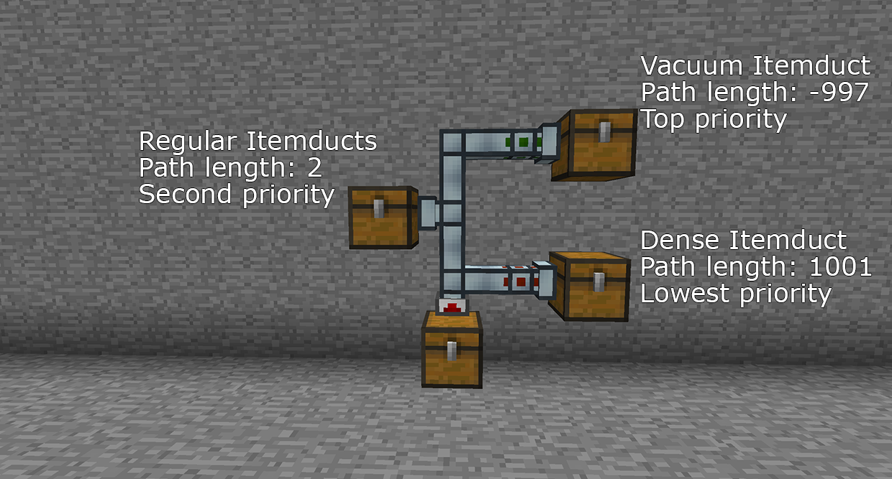

# Itemducts

Itemducts are used to transfer items.

Place a line of Itemducts along the path you want it to move, starting at the source and ending at the destination. You can use the Crescent Hammer to sever unwanted connections. Place a Servo on the connection to the source.

By default, the Servo will only extract while given a Redstone signal, but you can set it to work always.

Regular Itemducts are the most basic with the lowest maximum item speed at half a block per second.

Signalum-Plated Itemducts are identical to Itemducts, but can also transfer 4,000 RF/t.

Impulse Itemducts have a much faster transfer speed at 2 blocks per second.

Signalum-Plated Impulse Itemducts function identical to Impulse Itemducts, but can also transfer 4,000 RF/t.

All Itemducts can connect to Itemducts of different types.

The Crescent Hammer acts as a wrench. It can rotate most blocks, sever Duct connections, and instantly break Ducts if sneak right clicked.

# Priority

Itemducts will try to travel the shortest path by default. Each Itemduct between the origin and the destination adds 1 to the path length. You can use Dense and Vacuum Itemducts to change the priority of destinations.

Dense Itemducts will add 1000 to the path. Destinations past a Dense Itemduct will usually be the lowest priority.

Vacuum Itemducts will *remove* 1000 from the path. Destinations past a Vacuum Itemduct will usually be the highest priority.

